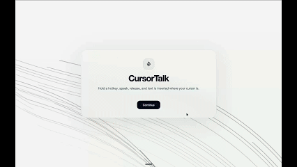
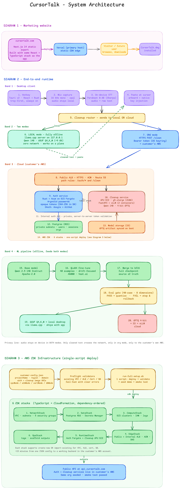

# CursorTalk

CursorTalk is a Mac-first voice dictation product built for people and teams that want fast text input, deterministic cleanup, and control over where processing happens.

It combines:

- a marketing website
- a desktop app
- a local AI runtime for personal use
- an organization-hosted runtime for enterprise use
- an auth service and AWS deployment layer for customer-managed environments

The product is designed around one workflow:

1. start dictation
2. speak naturally
3. stop dictation
4. get cleaned, usable text back


## Product Demo



## What makes CursorTalk different

Most products in this space either:

- stop at raw transcription
- depend on third-party AI APIs for every request
- give limited deployment control to enterprise customers

CursorTalk takes a different approach:

- **Personal Mode** runs locally on the user’s machine
- **Organization Mode** connects the desktop app to infrastructure controlled by the customer
- the cleanup layer is deterministic and dictation-specific
- the enterprise path is organization-aware rather than just API-key driven

## Product surfaces

### 1. CursorTalk Website

Purpose:

- product landing page
- feature explanation
- app download surface

Stack:

- Next.js 14
- React 18
- TypeScript
- Tailwind CSS
- static export mode via `output: 'export'`

Hosted on:

- Vercel


### 2. CursorTalk Desktop App

Purpose:

- native dictation client for macOS
- captures speech
- runs or connects to the cleanup pipeline
- inserts polished text into the active workflow

Stack:

- React 18
- TypeScript
- Vite
- Tauri 2
- Rust native layer

Key native capabilities:

- audio capture with `cpal`
- secure credentials with `keyring`
- clipboard access with `arboard`
- macOS integration through `objc2`
- global hotkeys via Tauri plugin

## Two operating modes

### Personal Mode

Personal Mode is the local-first experience.

What happens:

- the app downloads local speech and cleanup model assets on first setup
- speech-to-text runs locally on the machine
- cleanup runs locally through `llama.cpp`
- no organization backend is required

Current first-launch local download size:

- about **2.5 GB total**
- about **0.5 GB** for speech models
- about **2.0 GB** for the cleanup model

Best for:

- individual users
- privacy-sensitive local workflows
- environments where server dependency should be minimized

### Organization Mode

Organization Mode is the managed enterprise path.

What happens:

- the app verifies the workspace backend URL
- the user signs in with a workspace account
- the backend confirms organization membership
- cleanup requests are routed through the organization-managed service

The desktop experience remains simple, but the control model is much stronger for teams because:

- access is tied to user identity
- organization membership is enforced server-side
- backend runtime stays inside customer-controlled infrastructure

## End-to-end dictation pipeline

## Architecture Diagram



## Architecture Walkthrough Video

[Watch the architecture walkthrough](./README-assets/architecture-video.mp4)

### Personal Mode pipeline

1. user starts dictation from the desktop app
2. desktop app records microphone audio
3. local STT converts speech to raw transcript
4. local cleanup model rewrites the transcript into clean text
5. cleaned text is inserted back into the target app

### Organization Mode pipeline

1. user starts dictation from the desktop app
2. desktop app records microphone audio
3. local STT converts speech to raw transcript
4. transcript is sent to the organization cleanup API
5. FastAPI wrapper applies the fixed cleanup prompt
6. vLLM serves the organization cleanup model
7. cleaned text is returned to the desktop app
8. desktop app inserts the result into the target app

## Model and AI runtime details

### Speech-to-text

Runtime:

- `sherpa-rs` / Sherpa ONNX

Current speech model:

- `nemo-parakeet-tdt-0.6b-v2-int8`

Download source is wired in:

- `cursortalk-app/src-tauri/src/local_setup.rs`

### Local cleanup model

Runtime:

- `llama.cpp` via local server process

Format:

- `GGUF`

Current file name:

- `dictation-cleanup-q4km.gguf`

### Organization cleanup model

Serving runtime:

- `vLLM`

Current production packaging:

- `GPTQModel`

Current production metadata indicates:

- base model: `Qwen/Qwen2.5-14B-Instruct`
- model version: `2.0.0`
- quantization: `GPTQ-4bit-g128`
- serving engine: `vLLM`

Important product detail:

- the cleanup layer is configured as a **deterministic dictation cleanup engine**
- it is explicitly fine-tuned not to answer prompts or behave like an assistant

## Backend services

### Cleanup API

Stack:

- Python
- FastAPI
- Uvicorn
- Pydantic
- `httpx`

Role:

- receives raw dictation transcript text
- applies the cleanup system prompt
- forwards requests to vLLM
- exposes health/info endpoints
- reports model version metadata

### Auth service

Stack:

- Rust
- Axum
- PostgreSQL
- `sqlx`
- `tokio`
- `tower-http`
- `argon2`

Role:

- user authentication
- organization-aware identity
- session/token lifecycle
- enterprise access control for organization mode

## AWS and infrastructure layer

Stack:

- AWS CDK
- TypeScript

Primary AWS concepts in the current stack:

- ECS
- ECR
- EC2
- ALB
- Route53
- ACM
- RDS
- S3
- CloudWatch

The infrastructure layer exists to support customer-deployable enterprise environments rather than a single hardcoded central backend.

### Customer deployment model

The current customer deployment flow is driven by:

- `customers/customer-config.example.json`
- `infra/config/customer-config.schema.json`
- `infra/scripts/*.sh`
- `customer-infra-ops/*.sh`

Current preferred customer handoff:

1. copy `customers/customer-config.example.json`
2. fill `customers/customer-config.json`
3. run deploy/validate/seed/smoke scripts


## Repository layout

Main directories:

- `CursorTalk-Website/` — marketing website and download surface
- `cursortalk-app/` — Tauri desktop app
- `cursortalk-server/` — cleanup API wrapper in front of vLLM
- `cursortalk-auth-service/` — auth and org identity service
- `infra/` — AWS CDK and deployment scripts
- `customer-infra-ops/` — customer-facing wrapper scripts
- `customers/` — example and working customer config files
- `scripts/` — model/retraining/helper scripts
- `training-runs/` — fine-tune history and experiment outputs

## Local development

### Website

```bash
cd CursorTalk-Website
npm install
npm run dev
```

### Desktop app frontend

```bash
cd cursortalk-app
npm install
npm run dev
```

### Desktop app full Tauri run/build

```bash
cd cursortalk-app
npm run tauri
```

Build macOS app:

```bash
cd cursortalk-app
npm run tauri build -- --bundles app
```

### Infra

```bash
cd infra
npm install
npm run build
npm run synth
```


## Current product summary

CursorTalk is a dictation-focused product with:

- a website for positioning and distribution
- a desktop app for day-to-day usage
- a local-first path for individuals
- an organization-hosted path for enterprises
- a deterministic cleanup pipeline rather than a chatbot workflow
- an AWS/CDK layer for customer-managed deployment

The core product idea stays the same across all of it:

**speak naturally, get polished writing back, and keep control over where the intelligence runs.**
